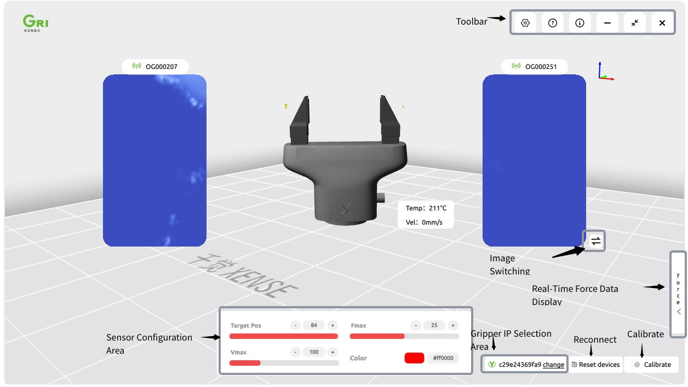

.. _tag_installation_and_setups:

III. Installation and Setup
===============================

1. Installation Steps
------------------------

**Windows Platform**
The XenseGripper.exe installer is provided. Double-click it and follow the on-screen prompts to complete the installation. After installation, a shortcut named "Xense Gripper" will appear on the desktop.

**Linux Platform**
The xensegripper.deb installer is provided. Use the sudo command to install it:

.. code-block:: bash

    sudo dpkg -i /path/to/your/XenseGripper_v1.0.1.deb
.. raw:: html

    

        <a href="https://pan.baidu.com/s/1pifsPkFevYTWBEq1PUNwDQ?pwd=yjcd"
           class="download-button"
           style="
               display: inline-flex;
               align-items: center;
               justify-content: center;
               padding: 0.75rem 2rem;
               background-color: #3B82F6;
               color: white;
               font-weight: 500;
               border-radius: 0.5rem;
               text-decoration: none;
               box-shadow: 0 4px 6px -1px rgba(59, 130, 246, 0.4);
               transition: all 0.3s ease;
           ">
            <i class="fa fa-download" style="margin-right: 0.5rem;"></i>
            Install XenseGripper
        </a>
    

    

2. Initial Configuration
----------------------------
After the program starts, the software interface will be displayed as shown in Figure 1:

.. raw:: html

    

    Figure 1: Initial Software Setup
