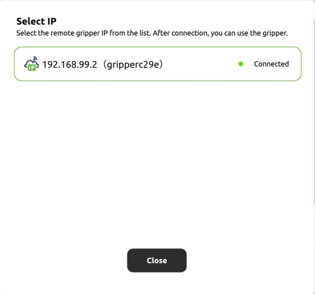
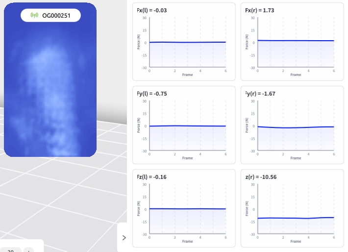

.. _tag_user_interface_and_interactions:

IV. User Interface and Interaction
=======================================

1. Select Gripper IP  
----------------------------------

    Figure 1: Gripper IP Selection Area

Under the "Change" option in the current Gripper IP Selection Area, you can select all gripper IPs within the local area network to connect to grippers with different IPs.
 

Sensor Status Indication
##############################

.. |online_icon| image:: ../../images/online_icon.png
    :alt: Online Icon
    :align: middle
    :width: 16px
    :height: 16px

.. |offline_icon| image:: ../../images/offline_icon.png
    :alt: Offline Icon
    :align: middle
    :width: 16px
    :height: 16px

.. |error_icon| image:: ../../images/error_icon.png
    :alt: Error Icon
    :align: middle
    :width: 16px
    :height: 16px

.. |resetup| image:: ../../images/resetup.png
    :alt: Rescan Icon
    :align: middle
    :width: 64px
    :height: 16px

|online_icon| : Indicates the device is online

|offline_icon| : Indicates the device is offline

|error_icon| : Indicates a sensor error. Hovering the mouse over it will display the error message (sensor config file reading failed).

After unplugging/plugging in the gripper, click |resetup| to rescan and reconnect to the sensor.

Tactile Information Display
################################

    Figure 2: Tactile Information Display

.. container:: content-paragraph
    
    The gripper sensor can detect tactile sensations and generate corresponding images. It can also display multi-dimensional force data in real time, facilitating accurate monitoring and control of the gripper's status and force-bearing conditions.

.. |calibration_button| image:: ../../images/calibration_button.jpg
    :alt: Calibration Button
    :align: middle
    :width: 16px
    :height: 16px
    
When the tactile image information is distorted or sensor data is stuck, click the |calibration_button| (Calibration Button) directly below under no-load conditions to recalibrate the sensor and refresh the display.

2. Gripper Sensor Configuration Area
-------------------------------------------------

.. figure:: ../../images/conf_zhua.png
    :alt: Gripper Configuration Area
    :align: center
    :scale: 100%
    :name: conf_zhua

    Figure 3: Gripper Configuration Area

.. |target| image:: ../../images/target.png
    :alt: Switch Target Position
    :align: middle
    :width: 16px
    :height: 16px

.. |vmax| image:: ../../images/vmax.png
    :alt: Set Maximum Speed
    :align: middle
    :width: 16px
    :height: 16px

    

|target| Move to Target Position: Click to move the sensor to the target position

|vmax| Set Maximum Sensor Speed: Adjusts the movement speed of the sensor

|fmax| Set Maximum Sensor Contact Force: Adjusts the contact force between the sensor and the object

|set_color| Set Gripper Status Light Color: Click the color button to set the color of the status light

3. Toolbar
----------------

.. figure:: ../../images/toolbar.png
    :alt: Toolbar
    :align: center
    :scale: 100%
    :name: _gs-toolbar

    Figure 4: Toolbar

.. |theme_switch| image:: ../../images/settings.png
    :alt: Settings Button
    :align: middle
    :width: 16px
    :height: 16px

.. |help| image:: ../../images/help.png
    :alt: Help Button
    :align: middle
    :width: 16px
    :height: 16px

.. |about| image:: ../../images/about.png
    :alt: About Button
    :align: middle
    :width: 16px
    :height: 16px

.. |minimization| image:: ../../images/minimization.png
    :alt: Minimize Button
    :align: middle
    :width: 16px
    :height: 16px

.. |maximization| image:: ../../images/maximization.png
    :alt: Maximize Button
    :align: middle
    :width: 16px
    :height: 16px
    
.. |exit| image:: ../../images/exit.png
    :alt: Exit Button
    :align: middle
    :width: 16px
    :height: 16px

|theme_switch| Settings: Theme appearance and language type in the settings interface

|help| Help: Opens help documentation and FAQ (Frequently Asked Questions)

|about| About: Displays application information

|minimization| Minimize: Minimizes the application to the background

|maximization| Maximize: Maximize the application to occupy the entire screen

|exit| Exit: Closes the current application