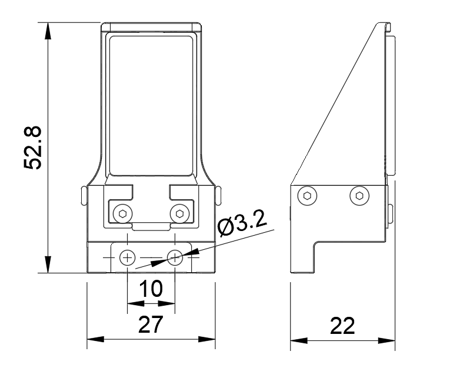

.. _tag_three_model:

二、触觉传感器金属外壳三维模型
========================================

1、 WS传感器外部尺寸
---------------------------

.. figure:: ../images/WS_chuan.png
    :alt: 软件初始设置
    :align: center
    :width: 400px
    :name: _hd-chuan
    :class: preserve-aspect-ratio

    图 1

.. raw:: html

    

    图 2

.. raw:: html

    

      

        <!-- 文件图标 -->
        

            <i class="fa fa-cube" style="font-size: 28px; color: #555555;"></i>
        

        
        <!-- 文件信息 -->
        

            
WS传感器模型.stp

            
3D模型文件 · STP格式

        

        
        <!-- Sphinx自带的下载指令 -->
        <a href=":download:`../../../../_static/WS传感器模型.stp"
            style="padding: 8px 16px; border: 1px solid #dddddd; border-radius: 6px; color: #333333; text-decoration: none; background-color: #ffffff; font-weight: 500; transition: all 0.2s ease; white-space: nowrap;">
            <i class="fa fa-download" style="margin-right: 6px;"></i> 下载文件
        </a>
      

    

2、 OS传感器外部尺寸
---------------------------

.. figure:: ../images/OS_chuan.png
    :alt: 软件初始设置
    :align: center
    :width: 400px
    :name: _hd-OS_chuan
    :class: preserve-aspect-ratio

    图 3

.. figure:: ../images/OS_chuan2.png
    :alt: 软件初始设置
    :align: center
    :width: 400px
    :name: _hd-OS_chuan2
    :class: preserve-aspect-ratio

    图 4

.. raw:: html

    

      

        <!-- 文件图标 -->
        

            <i class="fa fa-cube" style="font-size: 28px; color: #555555;"></i>
        

        
        <!-- 文件信息 -->
        

            
OS传感器模型.stp

            
3D模型文件 · STP格式

        

        
        
         <!-- Sphinx自带的下载指令 -->
        <a href=":download:`../../../../_static/OS传感器模型.stp"
            style="padding: 8px 16px; border: 1px solid #dddddd; border-radius: 6px; color: #333333; text-decoration: none; background-color: #ffffff; font-weight: 500; transition: all 0.2s ease; white-space: nowrap;">
            <i class="fa fa-download" style="margin-right: 6px;"></i> 下载文件
        </a>
      

    

三、Aurora Lite转接法兰
========================================

1、 franka转接法兰
---------------------------
.. figure:: ../images/Aurora-Lite-Flange-FR3-Panda.png
    :alt: 软件初始设置
    :align: center
    :width: 400px
    :name: Aurora-Lite-Flange-FR3-Panda
    :class: preserve-aspect-ratio

    图 1

.. raw:: html

    

.. raw:: html

    

      

        <!-- 文件图标 -->
        

            <i class="fa fa-cube" style="font-size: 28px; color: #555555;"></i>
        

        
        <!-- 文件信息 -->
        

            
Aurora Lite-Flange-FR3&Panda.STEP

            
模型文件 · STEP格式

        

        
        <!-- Sphinx自带的下载指令 -->
        <a href=":download:`../../../../_static/Aurora Lite-Flange-FR3&Panda.STEP"
            style="padding: 8px 16px; border: 1px solid #dddddd; border-radius: 6px; color: #333333; text-decoration: none; background-color: #ffffff; font-weight: 500; transition: all 0.2s ease; white-space: nowrap;">
            <i class="fa fa-download" style="margin-right: 6px;"></i> 下载文件
        </a>
      

    

2、非夕拂晓4机械臂转接法兰
---------------------------

.. figure:: ../images/Aurora-Lite-Flange-Rizon4.png
    :alt: 软件初始设置
    :align: center
    :width: 400px
    :name: Aurora-Lite-Flange-Rizon4
    :class: preserve-aspect-ratio

    图 2

.. raw:: html

    

      

        <!-- 文件图标 -->
        

            <i class="fa fa-cube" style="font-size: 28px; color: #555555;"></i>
        

        
        <!-- 文件信息 -->
        

            
Aurora Lite-Flange-Rizon4.STEP

            
模型文件 · STEP格式

        

        
        <!-- Sphinx自带的下载指令 -->
        <a href=":download:`../../../../_static/Aurora Lite-Flange-Rizon4.STEP"
            style="padding: 8px 16px; border: 1px solid #dddddd; border-radius: 6px; color: #333333; text-decoration: none; background-color: #ffffff; font-weight: 500; transition: all 0.2s ease; white-space: nowrap;">
            <i class="fa fa-download" style="margin-right: 6px;"></i> 下载文件
        </a>
      

    

3、 UR5机械臂转接法兰
---------------------------

.. figure:: ../images/Aurora-Lite-Flange-UR5.png
    :alt: 软件初始设置
    :align: center
    :width: 400px
    :name: Aurora-Lite-Flange-UR5
    :class: preserve-aspect-ratio

    图 3

.. raw:: html

    

      

        <!-- 文件图标 -->
        

            <i class="fa fa-cube" style="font-size: 28px; color: #555555;"></i>
        

        
        <!-- 文件信息 -->
        

            
Aurora Lite-Flange-UR5.STEP

            
模型文件 · STEP格式

        

        
        
         <!-- Sphinx自带的下载指令 -->
        <a href=":download:`../../../../_static/Aurora Lite-Flange-UR5.STEP"
            style="padding: 8px 16px; border: 1px solid #dddddd; border-radius: 6px; color: #333333; text-decoration: none; background-color: #ffffff; font-weight: 500; transition: all 0.2s ease; white-space: nowrap;">
            <i class="fa fa-download" style="margin-right: 6px;"></i> 下载文件
        </a>
      

    

4、 JAKA-S5机械臂转接法兰
---------------------------

.. figure:: ../images/Aurora-Lite-Flange-JAKA-S5.png
    :alt: 软件初始设置
    :align: center
    :width: 400px
    :name: Aurora-Lite-Flange-JAKA-S5
    :class: preserve-aspect-ratio

    图 4

.. raw:: html

    

      

        <!-- 文件图标 -->
        

            <i class="fa fa-cube" style="font-size: 28px; color: #555555;"></i>
        

        
        <!-- 文件信息 -->
        

            
Aurora Lite-Flange-JAKA S5.STEP

            
模型文件 · STEP格式

        

        
        
         <!-- Sphinx自带的下载指令 -->
        <a href=":download:`../../../../_static/Aurora Lite-Flange-JAKA S5.STEP"
            style="padding: 8px 16px; border: 1px solid #dddddd; border-radius: 6px; color: #333333; text-decoration: none; background-color: #ffffff; font-weight: 500; transition: all 0.2s ease; white-space: nowrap;">
            <i class="fa fa-download" style="margin-right: 6px;"></i> 下载文件
        </a>
      

    

四、g1-ws传感器转接件
========================================

1、 g1-ws-知行 120s
---------------------------
.. figure:: ../images/g1-ws-知行120s.png
    :alt: 软件初始设置
    :align: center
    :width: 400px
    :name: g1-ws-知行120s
    :class: preserve-aspect-ratio

    图 1

.. raw:: html

    

.. raw:: html

    

      

        <!-- 文件图标 -->
        

            <i class="fa fa-cube" style="font-size: 28px; color: #555555;"></i>
        

        
        <!-- 文件信息 -->
        

            
g1-ws-知行 120s.stp

            
模型文件 · stp格式

        

        
        <!-- Sphinx自带的下载指令 -->
        <a href=":download:`../../../../_static/g1-ws-知行 120s.stp"
            style="padding: 8px 16px; border: 1px solid #dddddd; border-radius: 6px; color: #333333; text-decoration: none; background-color: #ffffff; font-weight: 500; transition: all 0.2s ease; white-space: nowrap;">
            <i class="fa fa-download" style="margin-right: 6px;"></i> 下载文件
        </a>
      

    

2、g1-ws-Robotiq 2F-85
---------------------------

.. figure:: ../images/g1-ws-Robotiq2F-85.png
    :alt: 软件初始设置
    :align: center
    :width: 400px
    :name: g1-ws-Robotiq2F-85
    :class: preserve-aspect-ratio

    图 2

.. raw:: html

    

      

        <!-- 文件图标 -->
        

            <i class="fa fa-cube" style="font-size: 28px; color: #555555;"></i>
        

        
        <!-- 文件信息 -->
        

            
g1-ws-Robotiq 2F-85.stp

            
模型文件 · stp格式

        

        
        <!-- Sphinx自带的下载指令 -->
        <a href=":download:`../../../../_static/g1-ws-Robotiq 2F-85.STEP"
            style="padding: 8px 16px; border: 1px solid #dddddd; border-radius: 6px; color: #333333; text-decoration: none; background-color: #ffffff; font-weight: 500; transition: all 0.2s ease; white-space: nowrap;">
            <i class="fa fa-download" style="margin-right: 6px;"></i> 下载文件
        </a>
      

    

3、 g1-ws-Franka Panda
---------------------------

.. figure:: ../images/g1-ws-FrankaPanda.png
    :alt: 软件初始设置
    :align: center
    :width: 400px
    :name: g1-ws-FrankaPanda
    :class: preserve-aspect-ratio

    图 3

.. raw:: html

    

      

        <!-- 文件图标 -->
        

            <i class="fa fa-cube" style="font-size: 28px; color: #555555;"></i>
        

        
        <!-- 文件信息 -->
        

            
g1-ws-Franka Panda.stp

            
模型文件 · stp格式

        

        
        
         <!-- Sphinx自带的下载指令 -->
        <a href=":download:`../../../../_static/g1-ws-Franka Panda.stp"
            style="padding: 8px 16px; border: 1px solid #dddddd; border-radius: 6px; color: #333333; text-decoration: none; background-color: #ffffff; font-weight: 500; transition: all 0.2s ease; white-space: nowrap;">
            <i class="fa fa-download" style="margin-right: 6px;"></i> 下载文件
        </a>
      

    

4、 g1-ws-方舟无限 AC One
---------------------------

.. raw:: html

    

      

        <!-- 文件图标 -->
        

            <i class="fa fa-cube" style="font-size: 28px; color: #555555;"></i>
        

        
        <!-- 文件信息 -->
        

            
g1-ws-方舟无限 AC One left.step

            
模型文件 · step格式

        

        
        
         <!-- Sphinx自带的下载指令 -->
        <a href=":download:`../../../../_static/g1-ws-方舟无限 AC One left.step"
            style="padding: 8px 16px; border: 1px solid #dddddd; border-radius: 6px; color: #333333; text-decoration: none; background-color: #ffffff; font-weight: 500; transition: all 0.2s ease; white-space: nowrap;">
            <i class="fa fa-download" style="margin-right: 6px;"></i> 下载文件
        </a>
      

    

.. raw:: html

    

      

        <!-- 文件图标 -->
        

            <i class="fa fa-cube" style="font-size: 28px; color: #555555;"></i>
        

        
        <!-- 文件信息 -->
        

            
g1-ws-方舟无限 AC One right.step

            
模型文件 · step格式

        

        
        
         <!-- Sphinx自带的下载指令 -->
        <a href=":download:`../../../../_static/g1-ws-方舟无限 AC One right.step"
            style="padding: 8px 16px; border: 1px solid #dddddd; border-radius: 6px; color: #333333; text-decoration: none; background-color: #ffffff; font-weight: 500; transition: all 0.2s ease; white-space: nowrap;">
            <i class="fa fa-download" style="margin-right: 6px;"></i> 下载文件
        </a>
      

    

5、 g1-ws-星海图 R1 Lite
---------------------------

.. raw:: html

    

      

        <!-- 文件图标 -->
        

            <i class="fa fa-cube" style="font-size: 28px; color: #555555;"></i>
        

        
        <!-- 文件信息 -->
        

            
g1-ws-星海图 R1 Lite-left.step

            
模型文件 · step格式

        

        
        
         <!-- Sphinx自带的下载指令 -->
        <a href=":download:`../../../../_static/g1-ws-星海图 R1 Lite-right.step"
            style="padding: 8px 16px; border: 1px solid #dddddd; border-radius: 6px; color: #333333; text-decoration: none; background-color: #ffffff; font-weight: 500; transition: all 0.2s ease; white-space: nowrap;">
            <i class="fa fa-download" style="margin-right: 6px;"></i> 下载文件
        </a>
      

    

.. raw:: html

    

      

        <!-- 文件图标 -->
        

            <i class="fa fa-cube" style="font-size: 28px; color: #555555;"></i>
        

        
        <!-- 文件信息 -->
        

            
g1-ws-星海图 R1 Lite-right.step

            
模型文件 · step格式

        

        
        
         <!-- Sphinx自带的下载指令 -->
        <a href=":download:`../../../../_static/g1-ws-星海图 R1 Lite-right.step"
            style="padding: 8px 16px; border: 1px solid #dddddd; border-radius: 6px; color: #333333; text-decoration: none; background-color: #ffffff; font-weight: 500; transition: all 0.2s ease; white-space: nowrap;">
            <i class="fa fa-download" style="margin-right: 6px;"></i> 下载文件
        </a>
      

    

