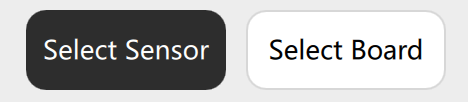
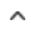
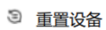
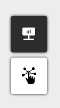
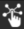
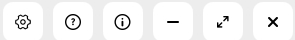
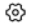
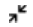
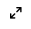

.. _tag_user_interface_and_interaction:

IV. Interface and Interaction
==================================

1. Sensor Selection   
-----------------------

    Figure 1: Data Acquisition Control Area

Under the "Select Sensor" option in the current Data Acquisition Control Area, you can monitor the multimodal perception information of the sensor in real time. It also supports recording the sensor feedback information for later "opening data stream" to conduct review, recap, and analysis.
 
 .. figure:: ../images/elements_selection_area.png
    :alt: Device Selection Area
    :align: center
    :scale: 100%
    :name: _xs-device_selection

    Figure 2: Device Selection Area

The software supports connecting multiple sensors simultaneously and enables quick switching between them.
The Device Selection Area displays the names of all sensors. By clicking |select_button| ,
you can quickly switch from the list of detected sensors to the target sensor, and its collected information will be displayed in the visualization area.

Sensor Status Indicators
##############################

|online_icon| : Indicates the device is online

|offline_icon| : Indicates the device is offline

|error_icon| : Indicates a sensor error. Hovering the mouse over it will display the error message (sensor config file failed to load).

After unplugging/plugging in the sensor, you need to click |resetup| to rescan the sensors.

Perception Mode Configuration
##################################

.. container:: row

    .. container:: perception-image

        |Perception_Mode_Configuration_Area|

    .. container:: perception-options
        
        |default(selected)| / |default(unselected)| Default: When the program is newly launched or the "Default" icon on the left side of the Perception Mode Configuration Area is clicked,
        the visualization area will display the sensor's tactile image information
        
        |contactforce(selected)| / |contactforce(unselected)| Contact Force: Click the "Contact Force" icon on the left side of the Perception Mode Configuration Area,
        and the visualization area will display the contact force reconstruction results and surface deformation field
    
.. container:: caption
    
    Figure 3: Perception Mode Configuration Area

Perception Mode Switching
##################

.. container:: content-paragraph
    
    Perception Mode switching enables flexible conversion of the tactile and contact force information fed back by the sensor between 2D planar and 3D spatial views. It presents the information in multimodal forms such as tactile images, contact force, and surface deformation field.

|
|
|

 .. figure:: ../images/touch_infromation_new.jpg
    :alt: Tactile Information
    :align: center
    :width: 500px
    :height: 450px
    :name: touch_info

    Figure 5: Tactile Information

|

    
When the tactile image information is distorted or sensor data retention occurs, click the |calibration_button| at the bottom center under no-load condition.
This allows recalibrating the sensor to refresh the display.

|

 .. figure:: ../images/contactforce_new.png
    :alt: Contact Force Information
    :align: center
    :width: 500px
    :height: 450px
    :name: contactforce_info

    Figure 6: Contact Force Information

|

The arrows in the 3D view are the results of contact force reconstruction. The direction of the arrow indicates the direction of the force, and the length of the arrow indicates the magnitude of the force. The curved surface area below the arrow
displays the perception result of the contact deformation field. In the 2D view, only the surface deformation field is displayed due to the limitation of visualization dimensions.

1. Toolbar
-------------

    Figure 7: Toolbar

.. |help| image:: ../images/help.png
    :alt: Help Button
    :align: middle
    :width: 16px
    :height: 16px

    

|theme_switch| Settings: Theme appearance and language type in the settings interface

|help| Help: Open help documentation and FAQ (Frequently Asked Questions)

|about| About: Display application information

|minimization| Minimize: Minimize the application to the background

|maximization| Maximize: Maximize the application to occupy the entire screen

|exit| Exit: Close the current application